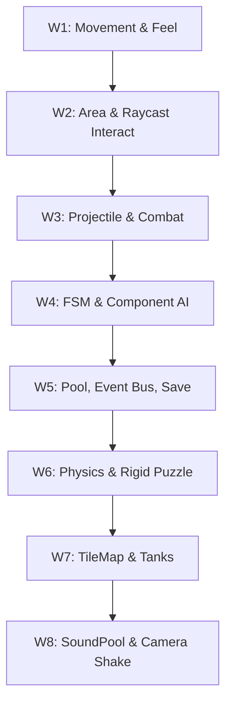

# Kurikulum & Bedah Mekanik: UKM Gamespace Genap

Dokumen ini membedah repositori [godot-gamespace-s-genap](https://github.com/syahrandywaskito/godot-gamespace-s-genap) yang merupakan kumpulan project materi pengajaran Godot Engine selama satu semester di UKM GAMESPACE. 

Tujuan dokumen ini adalah melakukan **dekonstruksi mekanik** dari setiap minggu ajaran, membedah kodenya, dan menghubungkannya dengan konsep teori serta pola arsitektur yang tersimpan di dalam folder [[Resources/Godot/Godot MOC|Resources]].

---

## 🗺️ Gambaran Silabus 8 Minggu



---

## 📅 BEDAH MATERI PER MINGGU

### 🎮 Minggu 1: Movement & Feel
*   **Detail Bedah Kode & Teori**: Lihat catatan lengkap di [[Projects/UKM Gamespace/Week 1 Movement dan Feel|Week 1 Movement dan Feel]].
*   **Fokus Teori**: Dasar gerak kinematic, vector manipulasi, dan feel pergerakan.
*   **Struktur Proyek**: `week 1 - movement & feel/2d/` (`Player2D.gd`, `Player2D.tscn`, `PlayBox2D.tscn`)
*   **Bedah Mekanik**:
    *   Mengimplementasikan pergerakan dasar platformer menggunakan koordinat [[Resources/Math/Vektor|Vector2]].
    *   Manipulasi variabel `velocity` secara manual sebelum memanggil fungsi `move_and_slide()` bawaan [[Physics/CharacterBody2D|CharacterBody2D]].
    *   Penerapan matematika dasar untuk akselerasi, deselerasi (friction), gravitasi, dan lompatan melengkung menggunakan [[Resources/Math/GDScript Math|GDScript Math]].

---

### 🔍 Minggu 2: Interaction System & Inventory Logic
*   **Fokus Teori**: Deteksi tabrakan non-padat vs Raycasting untuk interaksi dunia.
*   **Struktur Proyek**:
    *   `autoload/InventoryManager.gd`
    *   `autoload/SignalBus.gd`
    *   `2d/area detection/` (`PB2DAreaDetection.tscn`, `Player2DAD.tscn`)
    *   `2d/raycast detection/` (`PB2DRayDetection.tscn`, `Player2DRD.tscn`, `Raycast.gd`)
*   **Bedah Mekanik**:
    *   **Area Detection**: Menggunakan node [[Physics/Area2D|Area2D]] untuk sensor tabrakan pasif. Karakter mendeteksi koin/item lewat sinyal `body_entered` untuk dimasukkan ke `InventoryManager`.
    *   **Raycast Detection**: Menggunakan [[Physics/RayCast2D|RayCast2D]] untuk interaksi aktif terarah. Pemain harus menatap ke objek dan menekan tombol aksi untuk memicu sensor jarak tembak lurus menggunakan fungsi `is_colliding()`.

---

### ⚔️ Minggu 3: Projectile & Combat
*   **Fokus Teori**: Spawning instansiasi objek, perhitungan sudut tembakan, dan sistem HP.
*   **Struktur Proyek**: `week 3 - projectile & combat/2D/` (`ProjectileSpawner2D.gd`, `Projectile2D.gd`, `DummyTarget.gd`, `PlayerHealthBar.gd`)
*   **Bedah Mekanik**:
    *   **Spawning**: Memuat instansi peluru dinamis menggunakan fungsi `instantiate()` dari file scene `.tscn` yang di-load sebelumnya (`preload`).
    *   **Arah Tembak**: Menggunakan fungsi [[Resources/Math/Trigonometri|Trigonometri]] (`cos()`, `sin()`) pada rotasi mouse untuk menentukan arah gerak peluru linear.
    *   **Decoupled HP Bar**: Menggunakan progress bar kustom [[Resources/Godot/Control/Range/RangeControls|ProgressBar]] untuk HUD HP yang diupdate lewat sinyal dari script `PlayerHealthBar.gd` tanpa merusak arsitektur data.

---

### 🤖 Minggu 4: Enemy AI & Navigation (Component-Based)
*   **Fokus Teori**: Pola komposisi komponen dan State Machine dasar untuk AI.
*   **Struktur Proyek**: `week 4 - enemy AI & navigation/2D/`
    *   `Components/HealthComponent.gd`
    *   `Enemy/EnemyBase.gd`, `EnemyStateMachine.gd`
*   **Bedah Mekanik**:
    *   **Component-Based Composition**: Menghindari pewarisan kelas yang rumit (inheritance) dengan memecah fungsi ke node terpisah. Sebagai contoh, musuh dan pemain sama-sama memiliki [[Resources/System Design/Composition/Composition vs Inheritance|HealthComponent]] untuk menangani nyawa objek.
    *   **State Machine (FSM)**: Mengontrol transisi kondisi AI musuh (Patroli, Mengejar Player, Menyerang, Mati) menggunakan script [[Resources/System Design/FSM/Finite State Machine|EnemyStateMachine]].

#### Kode Contoh `HealthComponent.gd`:
```gdscript
class_name HealthComponent
extends Node

signal health_changed(current_health: float, max_health: float)
signal died

@export var max_health: float = 100.0
var current_health: float = 100.0

func _ready() -> void:
	if GameManager.save_game == null:
		current_health = max_health
		SignalBus.health_setup.emit(max_health)
	health_changed.emit(current_health, max_health)

func take_damage(amount: float) -> void:
	current_health = clamp(current_health - amount, 0, max_health)
	health_changed.emit(current_health, max_health)
	
	if current_health <= 0:
		died.emit()
```

---

### 💾 Minggu 5: Collectible, UI, & Data Persistence
*   **Fokus Teori**: Object pooling untuk optimasi memori, global event bus, dan sistem simpan game berbasis resource.
*   **Struktur Proyek**:
    *   `SignalBus.gd` (Event Bus global)
    *   `SaveGame.gd` (Resource penyimpanan)
    *   `2D/CoinPool.gd` (Object Pool untuk koin)
*   **Bedah Mekanik**:
    *   **Object Pooling**: Menghindari pemborosan memori saat koin diproduksi massal dengan teknik [[Resources/System Design/Design Patterns/Creational/Object Pooling|CoinPool]]. Koin yang dikoleksi tidak dihapus (`queue_free()`), melainkan hanya disembunyikan (`visible = false`, disable collision) dan dimasukkan kembali ke array pool untuk dipakai lagi.
    *   **Event Bus**: `SignalBus.gd` menjadi hub sinyal global agar komponen HUD UI, player, dan enemy tidak saling import satu sama lain (lihat [[Resources/System Design/Design Patterns/Behavioral/Event Bus|Event Bus]]).
    *   **Data Persistence**: Membuat class data yang mewarisi [[Resources/System Design/Godot/Godot Resources|Resource]] (`SaveGame.gd`) untuk menyimpan variabel posisi, HP, dan stamina pemain secara aman ke penyimpanan lokal (`user://save_data.tres`).

#### Kode Contoh `SaveGame.gd`:
```gdscript
class_name SaveGame
extends Resource

@export var player_position: Vector2 = Vector2.ZERO
@export var player_hp: float = 100.0
@export var player_stamina: float = 100.0
@export var player_coins: int = 0
@export var active_weapon_index: int = 0
@export var killed_enemies: Array[String] = []
@export var enemy_positions: Dictionary = {}
```

---

### 📦 Minggu 6: Physics-Based & Mechanic Puzzle
*   **Fokus Teori**: Fisika benda tegar (Rigid Body) dan deteksi sensor berat.
*   **Struktur Proyek**: `week 6 - physics based & mechanic puzzle/2D/` (`Box.tscn`, `StaticBox.tscn`, `PhysicsDetector.gd`)
*   **Bedah Mekanik**:
    *   Mengimplementasikan puzzle gerak teka-teki dengan mendorong objek bertipe [[Physics/RigidBody2D and StaticBody2D|RigidBody2D]] (Kotak Kayu) yang memiliki berat dan respon gaya dorong penuh.
    *   Menggunakan `PhysicsDetector.gd` berbasis [[Physics/Area2D|Area2D]] untuk membaca berat atau massa objek di atas tombol sensor lantai sebelum memicu pintu terbuka.

---

### 🚜 Minggu 7: Environmental Mechanic (Tanks)
*   **Fokus Teori**: Grid level dengan autotile, pergerakan kendaraan tank, dan tile custom property.
*   **Struktur Proyek**: `week 7 - environtmental mechanic/2D/` (`PalyboxW72D.tscn`, `TilesetTanks.tres`, `tank/TankPlayer2D.gd`, `tank/TilemapController.gd`)
*   **Bedah Mekanik**:
    *   Membangun arena pertempuran tank 2D menggunakan kisi grid [[Level Design/TileMap|TileMap]].
    *   **Tilemap Controller**: Script membaca data ID sel tanah tempat tank berdiri. Jika tank berada di sel "Lumpur" (dibaca menggunakan metadata koordinat tile), kecepatan jalan tank dikurangi secara dinamis di `TilemapController.gd`.

---

### 📣 Minggu 8: Finishing & Audio Optimization
*   **Fokus Teori**: Audio pooling untuk sound effect melimpah dan efek kamera dinamis.
*   **Struktur Proyek**: `week 8 - finishing/` (`SoundPool.gd`, `CamShake.gd`)
*   **Bedah Mekanik**:
    *   **SoundPool (Audio Pooling)**: Menggunakan autoload global berisi antrean node `AudioStreamPlayer` agar game bisa memutar suara tembakan, benturan, dan ledakan dalam jumlah banyak secara tumpang tindih tanpa terjadi lag atau audio terpotong.
    *   **Camera Shake**: Menerapkan getaran layar dinamis di `CamShake.gd` dengan memodifikasi properti `offset` pada [[Utility/Camera2D|Camera2D]] menggunakan perhitungan derau random (`randf_range`) yang memudar secara bertahap (lerp decay).

#### Kode Contoh `SoundPool.gd`:
```gdscript
extends Node
# SoundPool (Autoload) - Global Object Pooling untuk AudioStreamPlayer

@export var initial_pool_size: int = 15

var _available_players: Array[AudioStreamPlayer] = []
var _active_players: Array[AudioStreamPlayer] = []

func _ready() -> void:
	for i in range(initial_pool_size):
		_create_new_player()

func _create_new_player() -> AudioStreamPlayer:
	var player = AudioStreamPlayer.new()
	add_child(player)
	player.finished.connect(_on_player_finished.bind(player))
	_available_players.append(player)
	return player

func play_sound(stream: AudioStream, volume_db: float = 0.0, pitch_scale: float = 1.0, randomize_pitch: bool = false, bus: StringName = &"Master") -> AudioStreamPlayer:
	if stream == null:
		return null
		
	var player: AudioStreamPlayer
	if _available_players.is_empty():
		player = _create_new_player()
		_available_players.pop_back()
	else:
		player = _available_players.pop_back()
		
	_active_players.append(player)
	
	var final_pitch = pitch_scale
	if randomize_pitch:
		final_pitch *= randf_range(0.5, 2)
	
	player.stream = stream
	player.volume_db = volume_db
	player.pitch_scale = final_pitch
	player.bus = bus
	
	player.play()
	return player

func _on_player_finished(player: AudioStreamPlayer) -> void:
	_active_players.erase(player)
	_available_players.append(player)
```

---
Kembali ke [[README]] | Lihat juga: [[Resources/Godot/Godot MOC|Godot MOC]], [[Resources/Game Design/Game Design MOC|Game Design MOC]]
