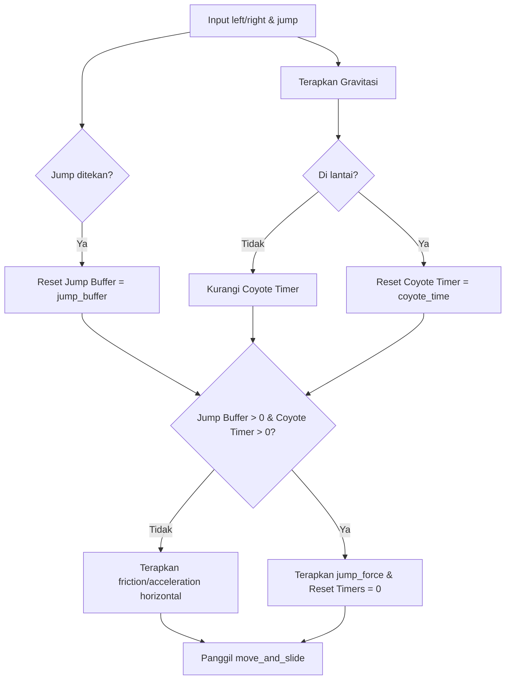

# UKM Gamespace: Week 1 - Movement & Feel

> [!TIP]
> **SARI MATERI (5 DETIK)**
> *   **Movement 2D**: Mengatur `velocity.x` menggunakan `move_toward` dengan friction/acceleration, dan `velocity.y` untuk gravitasi & lompatan.
> *   **Game Feel**: Menggunakan **Coyote Time** (toleransi melayang sesaat sebelum lompat) dan **Jump Buffer** (input lompat antre sebelum menapak tanah).
> *   **Movement 3D**: Mengalikan input vektor dengan arah basis kamera (`basis.z` dan `basis.x`) agar gerakan mengikuti sudut pandang kamera (*camera-relative movement*).
> *   **RigidBody Interaction**: Menerapkan gaya dorong ke `RigidBody3D` menggunakan `apply_central_force()` (dorong kontinu) dan `apply_central_impulse()` (tendang instan).

---

## 1. Platformer 2D Movement & Feel (`Player2D.gd`)

Script ini mengontrol gerakan dasar 2D platformer di Godot 4 menggunakan `CharacterBody2D`.



### A. Kode Lengkap `Player2D.gd`
```gdscript
class_name Player2D
extends CharacterBody2D

@export var animation: AnimatedSprite2D = null

@export_group("Health")
@export var max_health: float = 100

@export_group("Projectile Data")
@export var projectile_speed: float = 0
@export var projectile_damage: float = 0
@export var projectile_container: Node2D = null

@export_group("Player Data")
@export var move_speed: float = 0
@export var jump_force: float = 0
@export var friction: float = 0
@export var acceleration: float = 0

@export_group("Movement Multiplier")
@export var gravity_mult: float = 0
@export var speed_mult: float = 0
@export var jump_mult : float = 0

@export_group("Movement Feel")
@export var coyote_time: float = 0
@export var jump_buffer: float = 0

var _direction: float = 0
var _coyote_timer: float = 0
var _jump_buffer_timer: float = 0
var _last_direction: float = 0
var _current_health: float = 0

func _ready() -> void:
	_current_health = max_health

func get_current_health() -> float:
	return _current_health

func get_max_health() -> float:
	return max_health

func get_direction() -> float:
	return _last_direction

func _process(_delta: float) -> void:
	_animation()

func _physics_process(delta: float) -> void:
	if not is_on_floor():
		velocity += get_gravity() * delta * gravity_mult
		_coyote_timer -= delta
	else:
		_coyote_timer = coyote_time
	
	if Input.is_action_just_pressed("jump"):
		_jump_buffer_timer = jump_buffer
	
	_jump_buffer_timer -= delta
	
	_jump()
	_move()
	move_and_slide()

func _move() -> void:
	_direction = Input.get_axis("left", "right")
	if _direction != 0:
		_last_direction = _direction
		velocity.x = move_toward(velocity.x, move_speed * _direction * speed_mult, acceleration)
	else:
		velocity.x = move_toward(velocity.x, 0, friction)

func _jump() -> void:
	if _jump_buffer_timer > 0 and _coyote_timer > 0:
		velocity.y = -jump_force * jump_mult
		_jump_buffer_timer = 0
		_coyote_timer = 0

func _animation() -> void:
	if is_on_floor():
		if _direction != 0:
			animation.play("Move")
		else:
			animation.play("Idle")
	else:
		if velocity.y > 0:
			animation.play("Fall")
		elif velocity.y < 0:
			animation.play("Jump")
	
	_facing_direction()

func _facing_direction() -> void:
	if _direction > 0:
		animation.flip_h = false
	elif _direction < 0:
		animation.flip_h = true
```

### B. Bedah Logika & Game Feel
1.  **Akselerasi & Deselerasi (Friction)**:
    *   `move_toward(velocity.x, target, delta_speed)` meluncurkan kecepatan horizontal secara halus tanpa lonjakan instan (tidak kaku).
    *   Jika bergerak, kecepatannya mendekati `move_speed` dengan laju `acceleration`.
    *   Jika diam, kecepatannya kembali ke `0` dengan laju `friction`.
2.  **Coyote Time**:
    *   Mencegah ketidakadilan saat pemain berada tepat di ujung tebing. Timer `_coyote_timer` terus berjalan meskipun pemain melayang tanpa lompat. Pemain tetap dianggap "menyentuh tanah" selama beberapa milidetik setelah meninggalkan lantai.
3.  **Jump Buffer**:
    *   Menerima input tombol lompat beberapa frame sebelum kaki pemain menyentuh lantai, menyimpan input tersebut di `_jump_buffer_timer`, dan langsung memicu lompatan begitu pemain menyentuh lantai.

---

## 2. 3D Camera-Relative Movement (`Player3D.gd`)

Script ini mengatur gerakan karakter dalam ruang 3D, di mana arah gerakan disesuaikan dengan sudut pandang kamera (camera-relative) dan interaksi dengan RigidBody3D.

### A. Kode Lengkap `Player3D.gd`
```gdscript
class_name Player3D
extends CharacterBody3D

@export var max_health: float = 100

@export_group("Movement")
@export var move_speed: float = 0
@export var accelaration: float = 0
@export var rotation_speed: float = 0	
@export var jump_force: float = 0

@export_group("Feel")
@export var coyote_time: float = 0
@export var jump_buffer_time: float = 0

@export_group("Physics")
@export var push_force: float = 4.0

@onready var cam_controller: TPPCameraController = $TPPCameraController
@onready var visual: Node3D = $Visual

var _last_movement_direction: Vector3 = Vector3.ZERO
var _gravity: float = -45
var _coyote_timer: float = 0
var _jump_buffer_timer: float = 0
var _current_health: float = 0
var _external_speed_multiplier: float = 1.0

func get_current_health() -> float:
	return _current_health

func _ready() -> void:
	_current_health = max_health

func _physics_process(delta: float) -> void:
	if not is_on_floor():
		_coyote_timer -= delta
	else:
		_coyote_timer = coyote_time
	
	var raw_input := Input.get_vector("left", "right", "up", "down")
	var move_direction := cam_controller.get_forward() * raw_input.y + cam_controller.get_right() * raw_input.x 
	move_direction.y = 0
	move_direction = move_direction.normalized()
	
	var velocity_y = velocity.y
	velocity.y = 0.0
	velocity = move_direction * get_effective_move_speed()
	velocity.y = velocity_y + _gravity * delta
	
	if Input.is_action_just_pressed("jump"):
		_jump_buffer_timer = jump_buffer_time
	
	_jump_buffer_timer -= delta

	if _jump_buffer_timer > 0 and _coyote_timer > 0:
		velocity.y = jump_force
		_jump_buffer_timer = 0
		_coyote_timer = 0
	
	move_and_slide()
	force_impulse()
	
	if move_direction.length() > 0.2:
		_last_movement_direction = move_direction
	
	var target_angle := Vector3.BACK.signed_angle_to(_last_movement_direction, Vector3.UP)
	visual.global_rotation.y = lerp_angle(visual.rotation.y, target_angle, rotation_speed * delta)

func force_impulse() -> void:
	for i in get_slide_collision_count():
		var collision = get_slide_collision(i)
		var collider = collision.get_collider()
		
		if collider is RigidBody3D:
			var direction = -collision.get_normal()
			
			if collider.is_in_group("Pushable"):
				collider.apply_central_force(direction * push_force)
			
			if collider.is_in_group("Kickable"):
				collider.apply_central_impulse(direction * push_force)

func take_damage(damage: float) -> void:
	_current_health -= damage

func heal(amount: float) -> void:
	_current_health = min(_current_health + amount, max_health)

func set_external_speed_multiplier(multiplier: float) -> void:
	_external_speed_multiplier = max(multiplier, 0.0)

func get_effective_move_speed() -> float:
	return move_speed * _external_speed_multiplier
```

### B. Bedah Logika 3D & Fisika
1.  **Camera-Relative Movement**:
    *   Logika:
        ```gdscript
        var move_direction := cam_controller.get_forward() * raw_input.y + cam_controller.get_right() * raw_input.x
        ```
    *   Jika kamera menghadap ke depan, menekan tombol `W` (`raw_input.y` bernilai negatif) akan menggerakkan pemain ke arah depan kamera. Menekan `D` (`raw_input.x` bernilai positif) menggeser pemain ke kanan kamera.
    *   `move_direction.y = 0` memastikan karakter tidak terbang ke atas jika kamera menunduk ke bawah.
2.  **Slide Collision Interaction (Dorong RigidBody)**:
    *   Iterasi `get_slide_collision_count()` memeriksa apa saja benda tegar/fisik yang sedang ditabrak karakter saat memanggil `move_and_slide()`.
    *   Arah tabrakan diperoleh dari normal bidang sentuh: `direction = -collision.get_normal()`.
    *   `apply_central_force` vs `apply_central_impulse`:
        *   **Force**: Mendorong benda secara kontinu (sesuai arah sentuhan). Cocok untuk kotak berat/puzzle.
        *   **Impulse**: Memberi gaya instan (seperti ditendang). Cocok untuk bola atau tong meledak.

---

## 3. TPP Camera Controller (`TPPCameraController.gd`)

Script ini mengontrol kamera TPP (Third-Person Perspective) dengan mouse capture dan rotasi pivot.

### A. Kode Lengkap `TPPCameraController.gd`
```gdscript
class_name TPPCameraController
extends Node

@export var camera_pivot: Node3D = null
@export var camera: Camera3D = null
@export_range(0.0, 1.0) var mouse_sensitivity: float = 0.25

var _camera_input_direction: Vector2 = Vector2.ZERO
var _forward: Vector3 = Vector3.ZERO
var _right: Vector3 = Vector3.ZERO

func _input(event: InputEvent) -> void:
	if event.is_action_pressed("left_click"):
		Input.mouse_mode = Input.MOUSE_MODE_CAPTURED
	if event.is_action_pressed("ui_cancel"):
		Input.mouse_mode = Input.MOUSE_MODE_VISIBLE

func _unhandled_input(event: InputEvent) -> void:
	var is_camera_motion := (
		event is InputEventMouseMotion and
		Input.get_mouse_mode() == Input.MOUSE_MODE_CAPTURED
	)
	
	if is_camera_motion:
		_camera_input_direction = event.screen_relative * mouse_sensitivity
	
func _physics_process(delta: float) -> void:
	camera_pivot.rotation.x += _camera_input_direction.y * delta
	camera_pivot.rotation.x = clamp(camera_pivot.rotation.x, -PI / 6.0, PI / 3.0) 
	
	camera_pivot.rotation.y -= _camera_input_direction.x * delta
	_camera_input_direction = Vector2.ZERO
	
	_forward = camera.global_basis.z
	_right = camera.global_basis.x

func get_forward() -> Vector3:
	return _forward

func get_right() -> Vector3:
	return _right
```

### B. Bedah Logika Kamera
1.  **Mouse Capturing (`Input.MOUSE_MODE_CAPTURED`)**:
    *   Menyembunyikan kursor mouse dan menguncinya di tengah viewport agar gerakan mouse bisa dibaca tanpa batas layar terputus.
2.  **Basis Vectors (`global_basis`)**:
    *   `global_basis.z` dan `global_basis.x` mengambil orientasi arah hadap lokal kamera di dalam ruang global. Ini yang dikirim ke Player3D untuk kalkulasi arah gerakan horizontal pemain.

---
Lihat juga dokumentasi kurikulum utama: [[Projects/UKM Gamespace/Kurikulum dan Bedah Mekanik|Kurikulum dan Bedah Mekanik]] | Topik Terkait: [[Resources/Math/Vektor|Vektor]], [[Resources/Math/Trigonometri|Trigonometri]], [[Resources/Math/Linear Interpolation|Linear Interpolation]], [[Physics/CharacterBody2D]]
